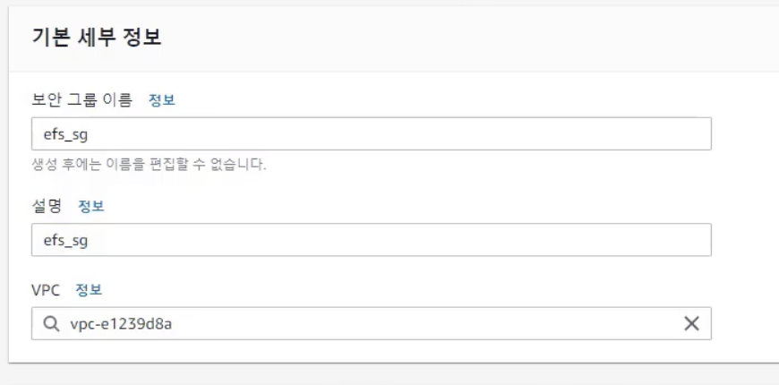

# \[실습] Elastic File System (EFS)

**기록 ✍️**

#### author : jung yuha

#### first registered : 2023-07-18 Tue

#### last modified : 2023-07-18 Tue

Elastic File System Storage를 만들고 리눅스 인스턴스 2개를 만들어 Elastic File System에 연결해보는 실습

## \[1] 보안그룹 생성하기

EFS는 보안그룹을 거친다. 따라서 EFS 생성 전에 보안그룹을 먼저 생성한다.

EC2 인스턴스가 EFS에 접속할 때 보안그룹을 통과하게 된다.

#### 왼쪽 메뉴 '네트워크 및 보안' > 오른쪽 상단 '보안 그룹 생성'

<figure><figcaption>
 보안 그룹 이름 설정
</figcaption></figure>

#### 인바운드 규칙 설정

<figure><figcaption>
 인바운드 규칙 설정
</figcaption></figure>

* 유형 : NFS
  * NFS 프로토콜을 인바운드 규칙에서 허용한다.
*   소스 : EC2 인스턴스에서 사용하는 보안그룹을 대상으로 허용한다.

    * 어디를 대상으로 허용할 지 설정&#x20;

    <figure><figcaption>
ssh_web_access 보안그룹을 선택
</figcaption></figure>

#### 보안그룹 생성 완료

<figure><figcaption>
 보안그룹 생성 완료
</figcaption></figure>

## \[2] EFS 생성하기

#### 상단 검색창 > 'EFS' 검색 > EFS 서비스 클릭 > 오른쪽 상단 '파일 시스템 생성' 클릭

<figure><figcaption>
 상단 검색창 > 'EFS' 검색
</figcaption></figure>

<figure><figcaption>
 오른쪽 상단 '파일 시스템 생성' 클릭
</figcaption></figure>

#### 이름 설정 후 '사용자 지정' 클릭

<figure><figcaption>
 이름만 설정하고 바로 생성한다.
</figcaption></figure>

### 상세 옵션 설정하기

#### 일반 설정

<figure><figcaption></figcaption></figure>

1. 이름
2. 가용성 및 내구성 : 리전 선택
   * 스토리지 클래스를 선택할 수 있다. : 리전 단위 / One Zone
3.  수명 주기 관리

    <figure><figcaption>
 수명 주기 관리
</figcaption></figure>

    *   파일 액세스 이후 n일이 경과한 다음에

        <figure><figcaption>
 파일 액세스 이후 n일이 경과
</figcaption></figure>

        *   스토리지 클래스를 전환할 수 있다. (IA 클래스 등..)

            <figure><figcaption>
 스토리지 클래스를 전환할 수 있다. (IA 클래스 등..)
</figcaption></figure>

4.
5. 성능 모드 선택 : 범용 / 최대IO
6. 처리량 모드 선택 : 버스트 / 프로비저닝됨
7. 암호화

#### EFS 생성
