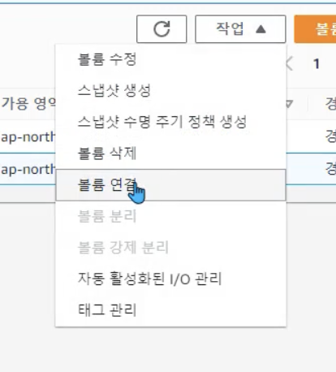

# \[실습] IAM 유저 , 그룹

**기록 ✍️**

#### author : jung yuha

#### first registered : 2023-06-07 Wed

#### last modified : 2023-06-07 Wed

## \[1] 계정 보안 강화

IAM의 리전은 **글로벌**로 설정되어있다.

## .png>)&#x20;

* 계정 설정 메뉴 클릭 > 암호 정책 편집&#x20;
*

    <figure><figcaption>
암호정책
</figcaption></figure>

*

    <figure><figcaption>
다양한 암호정책 설정
</figcaption></figure>

*

    <figure><figcaption>
대시보드 > 보안권장 사항 > MFA 추가
</figcaption></figure>

* 보안 자격증명 > MFA 할당
*  (1).png>)
*

    <figure><figcaption>
내 보안자격증명 > MAF 할당
</figcaption></figure>
* MFA 디바이스 관리&#x20;
* 인증 관리 앱 ( 가상 MFA 디바이스 ) (ex : 모바일 앱에서 구글 authentication 나 MS의 otp 서비스 같은 패스코드를 만들고 그 패스코드를 사용하여 로그인할 때 사용함 )
* MFA 디바이스 선택
*

    <figure><figcaption>
MFA 디바이스 선택 > 인증 관리자 앱
</figcaption></figure>

* QR 코드 표시 선택
* 암호를 설정하면 AWS 로그인시 직접 치지 않고 해당 MFA코드로 로그인이 가능하다.
*

    <figure><figcaption>
디바이스 설정 > QR 코드 보이기 > 암호 설정
</figcaption></figure>

## \[2] 사용자

* 사용자 메뉴 > 사용자 추가
*

    <figure><figcaption>
사용자 메뉴 > 사용자 추가
</figcaption></figure>

*

    <figure><figcaption>
사용자 추가 > 사용자 세부 정보
</figcaption></figure>

*   그룹이 없으니 그룹을 생성함

    <figure><figcaption>
사용자 권한 설정 : 그룹에 사용자 추가
</figcaption></figure>

* AWS에서 미리 만들어놓은 정책들 : 852개
*

    <figure><figcaption></figcaption></figure>
* 다음 예시는 모든 Resource와 모든 Action을 허용하는 권한의 예시임(AWS 전체에 대한 권한)
* Full 권한이나 읽기 권한같은 다양한 권한들이 있음
* 실습에서는 해당 권한(AdministratorAccess)로 그룹을 생성한다.
*

    <figure><figcaption>
그룹 생성
</figcaption></figure>

*   사용자 추가

    <figure><figcaption></figcaption></figure>

*

    <figure><figcaption>
사용자 생성 완료
</figcaption></figure>

*   사용자 그룹

    <figure><figcaption></figcaption></figure>

## \[3] 새로운 사용자로 Access 하기

* IAM 대시보드 > 오른쪽 상단의 AWS 계정 박스 > 이 계정 IAM 사용자를 위한 로그인 URL&#x20;
  * 기본 별칭을 바꿔 URL을 커스터마이징 할 수 있음
  *  (1).png>)
* 해당 URL로 들어가 해당 사용자의 계정으로 로그인 한다.
  *  (1) (1) (1) (1).png>)
  * 루트 사용자 계정이 아니므로 IAM 사용자라고 표시된다.
  *  (1) (1).png>)
* 로그인 종류 : IAM 사용자 / root 사용자 선택
*  (1).png>)

